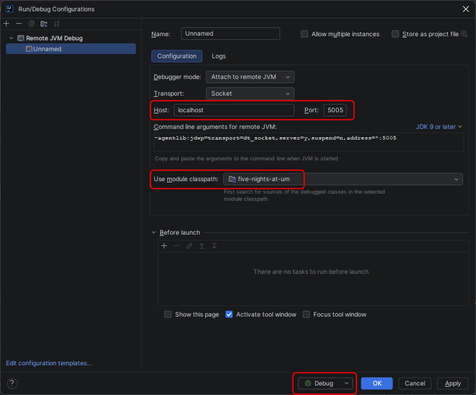
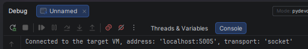
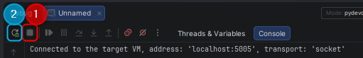

# Los libros de Buysan
Repositorio para el proyecto de la materia Desarrollo Seguro

## ¿Cómo levantar el proyecto?

Requisitos: Docker Desktop instalado y corriendo.

### 1. Variables de entorno

Copie `.env.example` a `.env` en la raíz del repo y complete con los valores del archivo proporcionado en la entrega nro. 3

### 2. Levantar el stack

```bash
docker compose up --build -d
```

Esto levanta tres contenedores:

| Servicio | Puerto | URL                                                                                                                                                 |
|---|---|-----------------------------------------------------------------------------------------------------------------------------------------------------|
| Frontend | 5173 | http://localhost:5173                                                                                                                               |
| Backend | 8080 | http://localhost:8080                                                                                                                               |
| Postgres | 5445 (configurable con `DB_PORT` en `.env`) | `localhost:5445` (expuesto solo para desarrollo local, ej. conectar con DBeaver). Si ese puerto tambien esta ocupado, cambie `DB_PORT` en su `.env`. |

### 3. Datos de prueba

La primera vez que arranca contra una base vacía, el backend carga automáticamente:
- 3 librerías de prueba (2 habilitadas: "Libreria Central" y "Libreria Norte"; 1 deshabilitada: "Libreria Dada de Baja"), cada una con su propio catálogo completo de 202 libros (606 libros en total).
- Los libros de la librería deshabilitada sirven para probar que dejan de verse en catálogo/búsqueda/detalle sin borrarse de la base.
- A futuro esto se implementara de otra manera (dueño carga el CSV de los libros - aún no implementado)
 
Para usar funcionalidades de comprador (favoritos, etc.) hay que registrar un usuario:

```bash
curl -X POST http://localhost:8080/api/auth/register \
  -H "Content-Type: application/json" \
  -d '{"username":"tu_usuario","email":"tu@email.com","password":"tu_password"}'
```

### 4. Reiniciar desde cero

Si cambia el modelo de datos y hace falta recrear la base:

```bash
docker compose down -v   # borra tambien el volumen de Postgres
docker compose up --build -d
```

## ¿Cómo debuguear el backend desde IntelliJ?

El servicio `backend` arranca con el agente JDWP de Java escuchando en el puerto **5005** (configurado en `docker-compose.yml` con `JAVA_TOOL_OPTIONS`). Así, IntelliJ se conecta al contenedor y se puede frenar en breakpoints mientras se usa el frontend en http://localhost:5173.

### 1. Levantar el stack

```bash
docker compose up --build -d
```

### 2. Poner breakpoints
Abrir el archivo que guste seguir, coloque el breakpoint **dentro del cuerpo del método**, no en la línea de la firma (`public ... search(...)`).

### 3. Crear la configuración de debug en IntelliJ
1. Menú **Run → Edit Configurations...**
2. **+** → **Remote JVM Debug**
3. Configurar:
   - **Host:** `localhost`
   - **Port:** `5005`
   - **Use module classpath:** dejar el default
4. Seleccionar el botón de debug.
5. En la consola de Debug tiene que aparecer **Connected to the target VM**.





### 5. Probarlo desde el navegador

1. Entrá a http://localhost:5173.
2. Realice la operación que espera que el breakpoint pare.

### Problemas comunes

- **No aparece "Connected to the target VM":** verificá que el contenedor esté arriba (`docker compose ps`) y que el puerto 5005 esté publicado. Si el puerto está ocupado, cambialo en `docker-compose.yml`.
- **Actualizó los breakpoints:** seleccione el "stop" de la consola de debug y luego el "Rerun"
